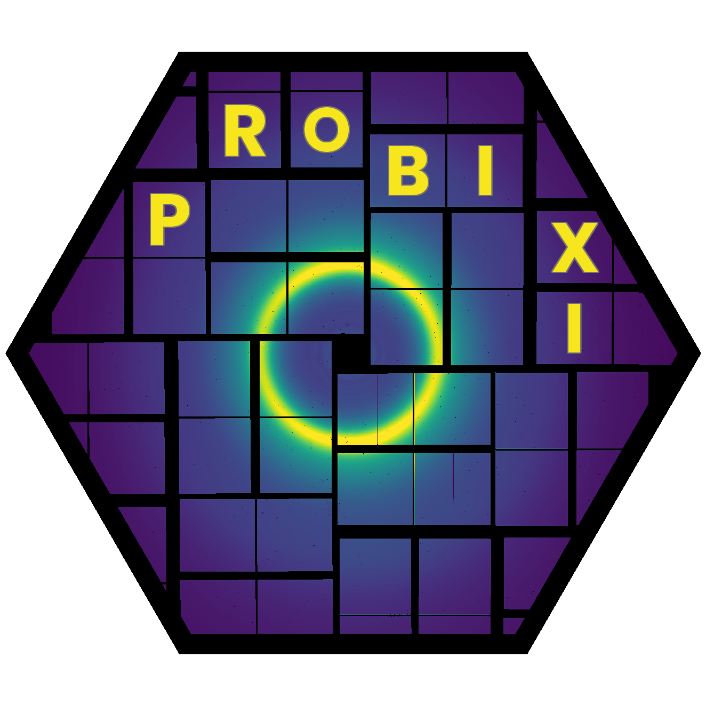

# probixi - Self-Calibrating (PROB)ab(I)listic Peak Detection for Serial (X)-Ray Crystallograph(I)c Data <a href="https://github.com/ryan-odea/probixi"></a>

[](https://lifecycle.r-lib.org/articles/stages.html#experimental)
[](https://pypi.org/project/probixi) 

[](https://pytorch.org/)
[](https://codecov.io/gh/ryan-odea/Probixi)
[](https://developer.nvidia.com/cuda-zone)
[](https://developer.apple.com/metal/pytorch/)
[](https://pepy.tech/project/probixi)
[](https://opensource.org/licenses/MIT)
[](https://probixi.readthedocs.io)
[](https://github.com/psf/black)

`probixi` proposes that bragg peaks can be found/recovered from a detector image by observing the background noise distributional shape over time, per pixel, and collecting peak candidates from an outlier set. Since this noise model is determined in an unsupervised fashion, the user does not need to tune hyperparameters for finding peaks. We are still testing robustness to different types of data collection (synchrotron, FEL) and random fluence changes, results will be included in this README as they arrive.


## Installing the Package

You can install via Pypi with pip:

```bash
pip install probixi
```

Or the latest development version with

```bash
pip install git+https://github.com/ryan-odea/probixi.git
```

## Using `probixi`

`probixi` can be interacted with either via the command line interface, or through the python API. In its current implementation, via python, the `Probixi` API returns iterables, which remain on a GPU tensor via pytorch up until collection - meaning that you can further pass information for any downstream processing. Through the CLI, this is currently a one-stop-shop for peakfinding and indexing. **This may change in the future**

`probixi` also has a 'burn-in' phase, where the noise model reaches some stable point, this can be further interrogated with a handy gif.

Via the CLI:

```bash
probixi -i files.lst -g myGeometry.geom -p myCell.cell -o stream.stream --device cuda --gif myNoiseModel.gif
```

Or with python:

```python
import torch

from probixi import Probixi, DataOffloader

pipeline = Probixi(
    list_file="files.lst",
    geometry_file="myGeometry.geom",
    cell_file="myCell.cell",
    device=torch.device("cuda"),
)

pipeline.noise_diagnostics("myNoiseModel.gif", stop=32)
cal = pipeline.calibrate(n_seed=1636)
print(f"kappa={cal.kappa:.2f}  prior_peak={cal.prior_peak:.4f}  "
      f"threshold={pipeline.threshold_calibration.threshold:.2f}")

# Stream every frame through detect -> index -> predict + integrate. The stream
# is lazy and each result stays on the GPU until you touch it, so you can branch
# off any downstream processing with torch
with DataOffloader(
    "stream.stream",
    geometry=pipeline.geometry,
    cell=pipeline.target_cell,
    geometry_file="myGeometry.geom",
    files=pipeline.metadata.files,
) as off:
    for result in pipeline.index_stream(pipeline.frames(), batch_size=8):
        off.write(result)  # or: pipeline.index_stream(...).to_stream(off)
        print(f"frame {result.frame_index}: "
              f"{result.n_indexed}/{result.n_peaks} indexed (rmsd {result.rmsd:.4f})")
```

### DuckDB output

The `.stream` format is convenient for interop (e.g. `partialator`), but querying a
run means re-parsing a large text file. `probixi` can instead write a
[DuckDB](https://duckdb.org) database. Please note this may be the default in the future.

```bash
probixi -i files.lst -g myGeometry.geom -p myCell.cell -o run.duckdb --device cuda
```

Or with python:

```python
stream = pipeline.index_stream(pipeline.frames(), batch_size=8)
stream.to_db(
    "run.duckdb",
    geometry=pipeline.geometry,
    cell=pipeline.target_cell,
    geometry_file="myGeometry.geom",
    files=pipeline.metadata.files,
)
```

The database holds run metadata as small tables (`geometry`, `panels`, `cell`) plus:

- **`frames`** — key `frame_id` (a hash of `filename//event`) with additional per-frame information
- **`reflections`** — the integrated Miller indices (`h k l`, `I`, `sigma`, `peak`,
  `background`, `fs/ss`, panel, resolution)
- **`peaks`** — the peak-search results per frame


### Using `probixi` as only a peakfinder

Of course, if you only want to use probixi as a peakfinder and prefer to use your own indexing regime, this is possible -- through the CLI's `--peaks-only` flag or the Python API's `peak_stream`.

Via the CLI:

```bash
probixi -i files.lst -g myGeometry.geom -o peaks.stream --peaks-only --device cuda
```

Or with python:

```python
import torch

from probixi import Probixi, PeakOffloader

pipeline = Probixi(
    list_file="files.lst",
    geometry_file="myGeometry.geom",
    device=torch.device("cuda"),
)

# Calibrate the noise model + detection threshold on the seed frames, as usual.
pipeline.calibrate(n_seed=1636)

peaks = pipeline.peak_stream(pipeline.frames(), estimate_scale=False)
with PeakOffloader(
    "peaks.stream",
    geometry=pipeline.geometry,
    geometry_file="myGeometry.geom",
    files=pipeline.metadata.files,
) as off:
    for result in peaks:
        if len(result):       # skip blanks; export only frames with peaks
            off.write(result)
```

## Dependencies

- python >= 3.9
  - click
  - h5py
  - hdf5plugin
  - numpy
  - torch
  - matplotlib
  - pillow
  - duckdb

## Contributing

There are many different ways to contribute to further development of this tool. If you experience a bug or would like an additional feature, please open up a [ticket](https://github.com/ryan-odea/probixi/issues). 

If you would like to contribute actively by merging code, please open a PR with the following:

1. Code is formatted with `isort`, then `black`, followed by a `ruff --check`. This will initiate on PR, so it might be best to check beforehand.
2. Docstrings are minimally on user-facing functions in [`numpy` style](https://numpydoc.readthedocs.io/en/latest/format.html). 
3. Comments, or some explanation (in PR) for the additions, limited to the scope of the project. If fixing a bug, comments should be included in the PR rather than the code itself.
